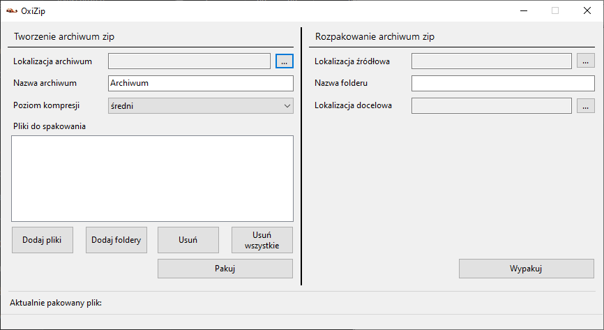

# OxiZip

## Description
OxiZip is a file archiver for Windows platform (x64 only). Program allows you to create and unpack ZIP archives. Created with .NET Windows Forms framework.

## Comparsion with 7-zip

| Type of data | Size | <i> OxiZip Time </i> | <i> OxiZip Compression </i> | 7-zip Time | 7-zip Compression | Selected compression level |
|--------------|------|---------------|------------------------|--------------|---------------------|----------------------------|
| Mini Metro Game Folder | 290 MB | <b>31.9s </b> | <b> 67% </b> | 41.4s | 65% | Highest |
| MP4 File | 273 MB | <b> 8.5s </b> | <b> 89% </b> | 11.5s | 88% | Highest |
| 10 JPG Files | 69 MB | <b> 3.4s </b> | <b> 99% </b> | 5.1s | <b> 99% </b> | Highest |
| Among Us Game Folder | 444 MB | <b> 43.8s </b> | <b> 38% </b> | 1:21.9s | 37% | Medium |

## Installation

OxiZip is portable - you don't have to install it. To use program, download a newest version zip file from section below, which contains all necessary files. After unpacking an archive, you can use program by starting OxiZip.exe.

Yes, I made this archive using OxiZip. 

And yes, you can unpack it using OxiZip located inside.

## Releases
| Version | Link | Major changes |
|---------|------|---------------|
| 1.2.2 | [Download](https://github.com/karolstawowski/OxiZip/raw/master/Releases/OxiZip_1.2.2.zip) | Fix: Allow archive to ommit packing archive itself |
| 1.2.1 | [Download](https://github.com/karolstawowski/OxiZip/raw/master/Releases/OxiZip_1.2.1.zip) | Improve preformance |
| 1.2.0 | [Download](https://github.com/karolstawowski/OxiZip/raw/master/Releases/OxiZip_1.2.zip) | Drag and drop items, improve accessibility |
| 1.1.0 | [Download](https://github.com/karolstawowski/OxiZip/raw/master/Releases/OxiZip_1.1.zip) | Folders handling, improve packing status info, select target packing folder |
| 1.0.0 | [Download](https://github.com/karolstawowski/OxiZip/raw/master/Releases/OxiZip_1.0.zip) | 

## Usage

 ### Packing ZIP archive
 From top to bottom options:
 - Target location for newly created ZIP
 - Name of new archive
 - Compression level (without compression/fast/best)
 - List with files to pack (you can drag-and-drop items)
 - Add files
 - Add folder
 - Remove selected file from the list
 - Remove all files from the list
 - Pack
 - Currently packed item
 
 If file already exists, program asks you if you want to overwrite or add files to existing archive.
 
 ### Unpacking ZIP archive
 From top to bottom options:
 - Archive source location
 - Name of folder to pack into (optionally)
 - Target location for items to unpack
 - Unpack

## Tools and technologies
C#, Windows Forms, Visual Studio.
